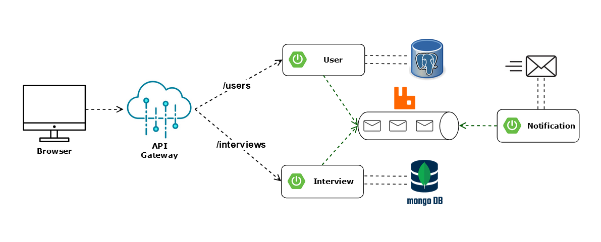

# Microservices Diagram

  

**Browser:** 

- Acts as the front-end interface where users (candidates, interviewers) interact with
the platform.

**API Gateway:** 

- The entry point for all client requests. It routes requests to appropriate microservices (e.g., /users for user-related operations and /interviews for interview-related operations).

**User Service:**

- Handles user management and authentication.
- Stores user profiles and credentials in a PostgreSQL database.
- Responsible for authorization

**Interview Service:**

- Manages the core business logic related to interviews.
- Stores interview-related data in MongoDB.

**Notification Service:**

   - Sends notifications to users via email.
   - Uses a message broker (RabbitMQ) for asynchronous processing of tasks.

**Message Broker (RabbitMQ):**

- Facilitates communication between microservices (e.g., sending notifications when a new interview is scheduled).
- Decouples services, ensuring scalability and fault tolerance.

**Databases:**

- PostgreSQL for relational data storage related to users.
- MongoDB for storing non-relational data, such as interview records.
