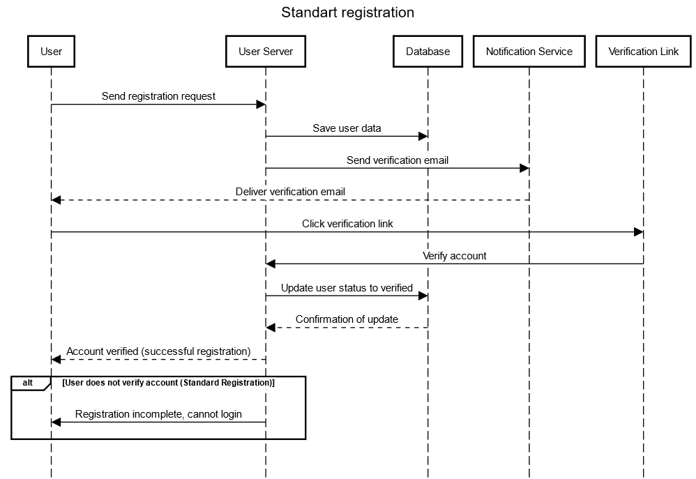
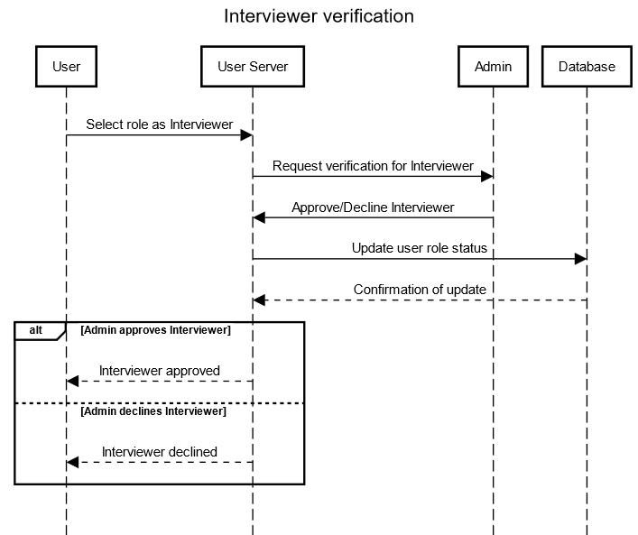
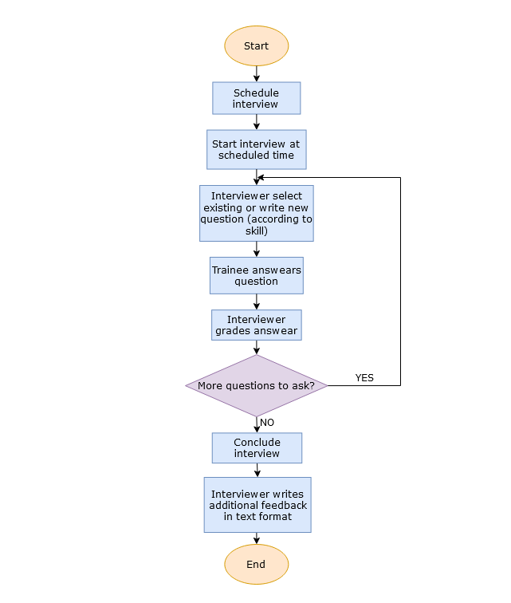
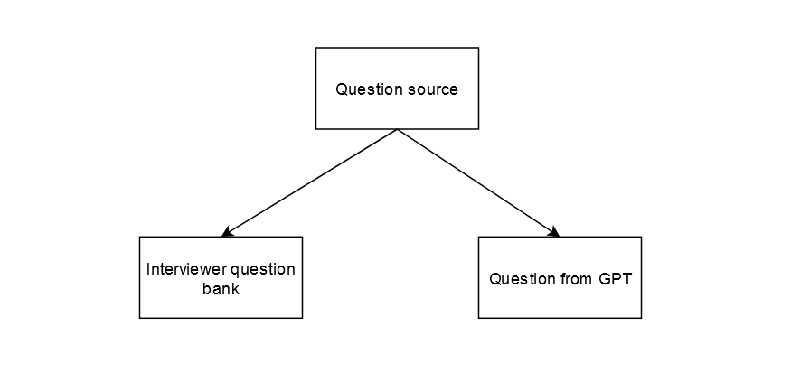

# Business Cases

## Contents

- [Registration process](#registration)
    - [Usecase diagram]()
    - [Sequence diagram]()
- [Interview process](#interview)
    - [Usecase diagram]()
    - [Block schema]()
- [Skills](#skills)
    - [Skill tree structure](#skill-tree-structure)
    - [Skill match](#skill-match)
- [Question bank](#question-bank)
    - [Question source](#questions-source)
    - [Question bank filling](#question-bank-filling)

## Registration
### Usecase

  

[//]: # (![Registration usecase diagram]&#40;/imgs/registration_usecase.png&#41;)
### Sequence

  

[//]: # (![Registration sequence diagram]&#40;/imgs/registration_sequence.png&#41;)

  

[//]: # (![Interviewer verification diagram]&#40;/imgs/interviewer_verification_sequence.png&#41;)

## Interview
### Usecase

  

[//]: # (![Interview usecase diagram]&#40;/imgs/interview_usecase.png&#41;)
### Block schema

  

[//]: # (![Interview block schema]&#40;/imgs/interview_block_schema.png&#41;)
## Skills
### Skill tree structure

  

[//]: # (![Skill tree]&#40;/imgs/skill_tree.png&#41;)
### Skill match

  

[//]: # (![Skill match diagram]&#40;/imgs/skill_match.png&#41;)

## Question bank
### Questions source

  

[//]: # (![Question source]&#40;/imgs/question_source.png&#41;)
### Question bank filling

  

[//]: # (![Question bank]&#40;/imgs/question_bank_sequence.png&#41;)
